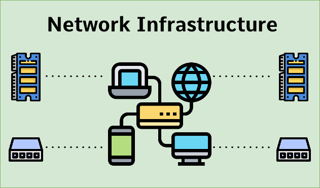
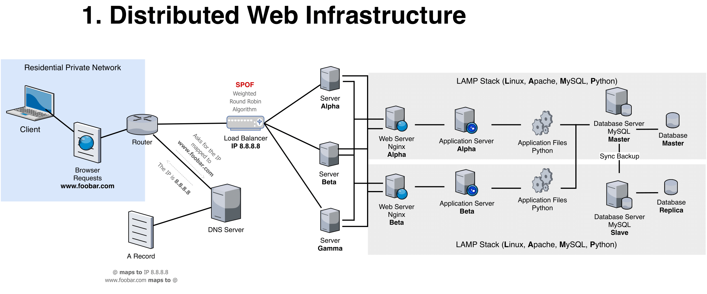

# Web infrastructure design

## Resource

- [What is a database](https://www.oracle.com/ke/database/what-is-database/)  
- [What’s the difference between a web server and an app server?](https://www.infoworld.com/article/2077354/app-server-web-server-what-s-the-difference.html)  
- [DNS record types](https://www.site24x7.com/learn/dns-record-types.html)  
- [High availability cluster (active-active/active-passive)](https://docs.oracle.com/cd/E17904_01/core.1111/e10106/intro.htm#ASHIA714)  
- [What is HTTPS](https://www.instantssl.com/http-vs-https)  
- [What is a firewall](https://www.webopedia.com/definitions/firewall/)  

Web Applications Infrastructure/Web Infrastructure also called internet infrastructure is the physical hardware, transmission media, and software used to interconnect computers and users on the Internet.

- Simple Web Infrastructure
- Distributed Web Infrastructure
- Monitored Web Infrastructure

## Learning Objectives

- You must be able to draw a diagram covering the web stack you built with the `*sysadmin/devops*` track projects
- You must be able to explain what each component is doing
- You must be able to explain `system redundancy`
- Know all the mentioned acronyms: `LAMP`, `SPOF`, `QPS`

## Simple Web Infrastructure

  
[see lamp stack](https://en.wikipedia.org/wiki/LAMP_%28software_bundle%29)  

- 1 server
- 1 web server `(Nginx)`
- 1 application server
- 1 application files (your code base)
- 1 database `(MySQL)`
- 1 domain name `foobar.com` configured with a `www` record that points to your server IP `8.8.8.8`

## Distrubuted Web Infrasture

- 2 servers
- 1 web server `(Nginx)`
- 1 application server
- 1 load-balancer `(HAproxy)`
- 1 set of application files (your code base)
- 1 database `(MySQL)`

## Monitored web infrastructure

- 3 firewalls
- 1 SSL certificate to serve [see foobar](www.foobar.com) over HTTPS  
- 3 monitoring clients (data collector for Sumologic or other monitoring services)
